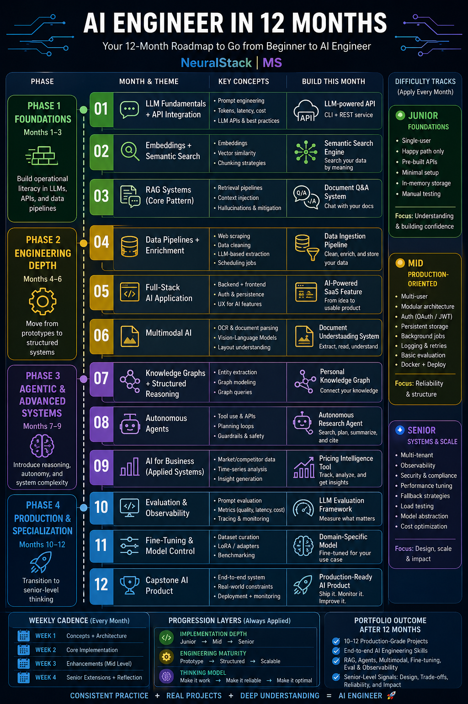

# 🚀 AI Engineer in 12 Months
### A Project-Based Roadmap to Go from Beginner to Production-Ready AI Engineer



---

## 📌 Overview

This repository provides a **structured, hands-on roadmap** to becoming an AI Engineer in 12 months.

Instead of focusing on theory alone, this roadmap emphasizes:
- Building **real-world AI systems**
- Progressing from **prototype → production**
- Developing **portfolio-grade projects**
- Thinking like an **engineer, not just a user of APIs**

---

## 🧭 How This Roadmap Works

Each month focuses on a **core AI engineering concept** and a **practical project**.

Every project is designed with **three difficulty levels**:
- 🟢 **Junior** — Foundations and working prototypes
- 🟡 **Mid** — Production-oriented systems
- 🔵 **Senior** — Scalable, reliable, and optimized architectures

---

## 🧱 Roadmap Structure

### **Phase 1 — Foundations (Months 1–3)**
Build operational literacy in LLMs, APIs, and data pipelines.

| Month | Topic | Project |
|------|------|--------|
| 01 | LLM Fundamentals + API Integration | LLM-powered API (CLI + REST) |
| 02 | Embeddings + Semantic Search | Semantic Search Engine |
| 03 | RAG Systems (Core Pattern) | Document Q&A System |

---

### **Phase 2 — Engineering Depth (Months 4–6)**
Move from prototypes to structured systems.

| Month | Topic | Project |
|------|------|--------|
| 04 | Data Pipelines + Enrichment | Data Ingestion Pipeline |
| 05 | Full-Stack AI Application | AI-powered SaaS Feature |
| 06 | Multimodal AI | Document Understanding System |

---

### **Phase 3 — Agentic & Advanced Systems (Months 7–9)**
Introduce reasoning, autonomy, and system complexity.

| Month | Topic | Project |
|------|------|--------|
| 07 | Knowledge Graphs + Structured Reasoning | Personal Knowledge Graph |
| 08 | Autonomous Agents | Research Agent |
| 09 | AI for Business (Applied Systems) | Pricing Intelligence Tool |

---

### **Phase 4 — Production & Specialization (Months 10–12)**
Transition to senior-level thinking and production systems.

| Month | Topic | Project |
|------|------|--------|
| 10 | Evaluation & Observability | LLM Evaluation Framework |
| 11 | Fine-Tuning & Model Control | Domain-Specific Model |
| 12 | Capstone AI Product | Production-Ready AI System |

---

## 🛠️ Monthly Workflow

Each month follows a consistent execution model:

- **Week 1:** Concepts + Architecture
- **Week 2:** Core Implementation
- **Week 3:** Enhancements (Mid-Level)
- **Week 4:** Senior Extensions + Reflection

---

## 📈 Progression Model

This roadmap is built around three parallel growth dimensions:

### 1. Implementation Depth
- Build → Structure → Scale

### 2. Engineering Maturity
- Prototype → Production → Robust Systems

### 3. Thinking Model
- Make it work → Make it reliable → Make it optimal

---

## 📂 Repository Structure
```
ai-engineer-12-month-roadmap/
│
├── README.md
├── roadmap/
│   ├── ai-engineer-12-months.png
│   └── ai-engineer-12-months.pdf   (optional)
│
├── content/
│   ├── month-01-llm-fundamentals.md
│   ├── month-02-embeddings.md
│   └── ...
│
├── templates/
│   ├── project-template.md
│   └── article-template.md
│
└── LICENSE
```

---

## 🎯 Who This Is For

- Software engineers transitioning into AI
- Developers who prefer **learning by building**
- Engineers aiming for **production-level AI skills**
- Anyone building a **serious AI portfolio**

---

## 🧠 What You’ll Learn

By completing this roadmap, you will gain experience in:

- LLM application development
- Retrieval-Augmented Generation (RAG)
- AI agents and tool usage
- Multimodal systems (text + vision)
- Data pipelines and enrichment
- Evaluation and observability
- Model fine-tuning and control
- Full-stack AI product development

---

## 🏆 Portfolio Outcome

After 12 months, you will have:

- 10–12 **portfolio-grade AI projects**
- Demonstrated experience with:
  - RAG systems
  - AI agents
  - Multimodal pipelines
  - Evaluation frameworks
- Strong signals in:
  - System design
  - Trade-off analysis
  - Production readiness

---

## 🤝 Contributing

Contributions are welcome. You can:
- Improve project implementations
- Add alternative tech stacks
- Suggest optimizations
- Contribute new project ideas
- Add translations

Please open an issue or submit a pull request.

---

## ⭐ Support

If you find this roadmap valuable:
- Star this repository
- Share it with others
- Follow for updates

---

## 📜 License

This project is licensed under the MIT License.

---

## 🔗 About NeuralStack | MS

NeuralStack | MS is focused on:
- Modern software development
- AI engineering
- Security engineering

Follow along for deep dives, projects, and insights into building intelligent systems.

---


